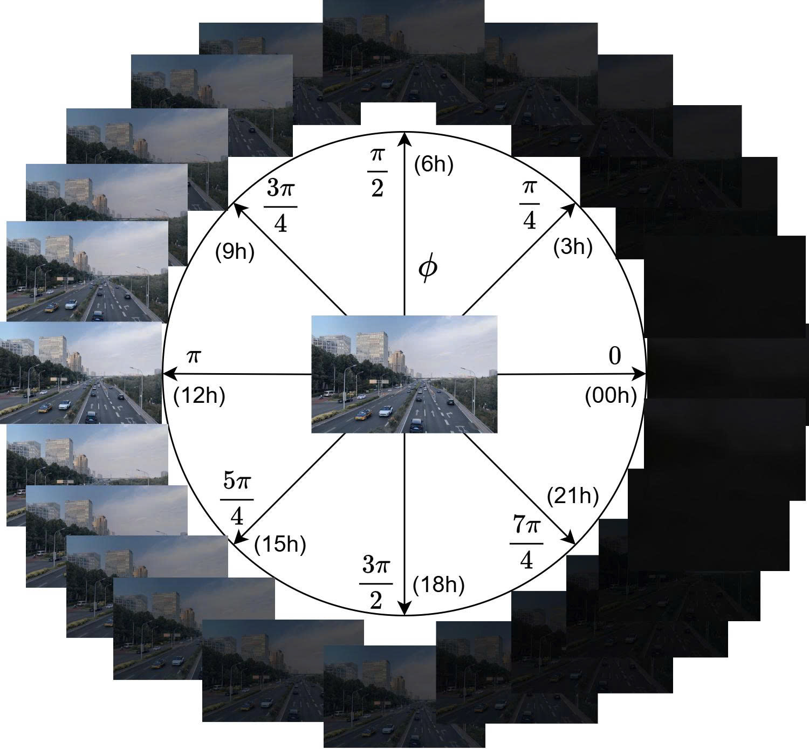

# CR-Net: A Continuous Rendering Network for Enhancing Processing in Low-Light Environments

<p align="center">
    📄 <a href="link-to-your-paper"><b>Paper</b></a>&nbsp;&nbsp; | &nbsp;&nbsp;
    💻 <a href="https://github.com/val-utehy/CR-Net"><b>Source Code</b></a>&nbsp;&nbsp; | &nbsp;&nbsp;
    🤗 <a href="https://huggingface.co/val-utehy/CR-Net"><b>Hugging Face</b></a>
</p>

<p align="center">
    
<p>

<p align="center">
    <em>Architecture of the CR-Net model.</em>
<p>

## Introduction

**CR-Net**  is a novel transformer-based I2I framework that provides continuous control over illumination conditions to generate realistic and diverse images, particularly low-light ones, without requiring style samples during inference.
To learn more about CR-Net, feel free to read our documentation [English](../README.md) | [Tiếng Việt](preview/README-vi.md) | [中文](preview/README-zh.md).
<p align="center">
    
<p>

<p align="center">
    <em>Smooth continuous light to dark transition with phi angle</em>
<p>

### Key Features

*   **Continuous translation:** CR-Net is capable of achieving smooth continuous translations, as well as cyclic translations, such as across different times of the day.
*   **Arbitrary illumination:**  By varying the light variable, high-quality continuous image translations between daytime and nighttime can be efficiently obtained.
*   **Data augmentation:** The proposed model facilitates the generation of realistic and diverse low-light images for training and advancing deep learning–based computer vision applications.

## Demo


## Installation and Requirements

To run this model, you need the proper environment. We recommend the following versions:

*   **Python:** `Python >= 3.10` (Recommended `Python 3.10`)
*   **PyTorch:** `PyTorch >= 1.12` (Recommended `PyTorch 2.1.2`)

**Step 1: Clone the repository**

```shell
  git clone https://github.com/val-utehy/CR-Net.git
  cd CR-Net
```
**Step 2: Install dependencies**

```shell
  pip install -r requirements.txt
```

> [!NOTE]
> Make sure you have installed the compatible versions of **torch** and **torchvision** with your **CUDA driver** to leverage GPU.
## Pretrained Models
The pretrained models are available at: [link](https://drive.google.com/drive/folders/13_9MPiA9kfznIBCqHE6nuvAVrHEjPLLJ).  
> [!NOTE]  
> Put all weights downloaded to [./checkpoints_v2/ast_rafael_v2_sharpening](./checkpoints_v2/ast_rafael_v2_sharpening).  
> Please ensure your path to the checkpoint and config (`opt.pkl`) is correct in the script files before running.


## Usage Guide

### 1. Model Training

Training file will be updated soon!

[//]: # (To train the CR-Net model on your own dataset, follow these steps:)

[//]: # ()
[//]: # (**a. Configure the training script file:**)

[//]: # ()
[//]: # (Open and edit the file `train_scripts/ast_n2h.sh`. In this file, you need to specify important paths such as the dataset path and the checkpoint saving directory.)

[//]: # ()
[//]: # (**b. Run the training script:**)

[//]: # ()
[//]: # (After finishing the configuration, navigate to the project’s root directory and execute the following command:)

[//]: # ()
[//]: # (```shell)

[//]: # (    bash train_scripts/ast_n2h_dat.sh)

[//]: # (```)
### 2. Testing and Inference

**a. Video Processing:**

#### 1. Configure the script file:
Open and edit the file `test_scripts/ast_inference_video.sh`. Here, you need to provide the path to the trained checkpoint and the input/output video paths.

#### 2. Run the video processing script:
After completing the configuration, navigate to the project’s root directory and execute the following command:

```shell
  bash test_scripts/ast_inference_video.sh
```

**b. Image Directory Processing:**
#### 1. Configure the script file:
Open and edit the file `test_scripts/ast_n2h_dat.sh`. Here, you need to provide the path to the trained checkpoint and the input/output image directory paths.

#### 2. Run the image directory processing script:
After completing the configuration, navigate to the project’s root directory and execute the following command:

```shell
  bash test_scripts/ast_n2h.sh
``` 

## Citation


[//]: # (```bibtex)

[//]: # (@article{crnet2025,)

[//]: # (    title={CR-Net: A Continuous Rendering Network for Improving Robustness to Low-illumination},)

[//]: # (    author={},)

[//]: # (    journal={},)

[//]: # (    year={2025})

[//]: # (})

[//]: # (```)
## References

1. https://github.com/EndlessSora/TSIT

2. https://github.com/astra-vision/CoMoGAN

3. https://github.com/AlienZhang1996/S2WAT


## License
This project is licensed under the MIT License - see the [LICENSE](LICENSE) file for details.
