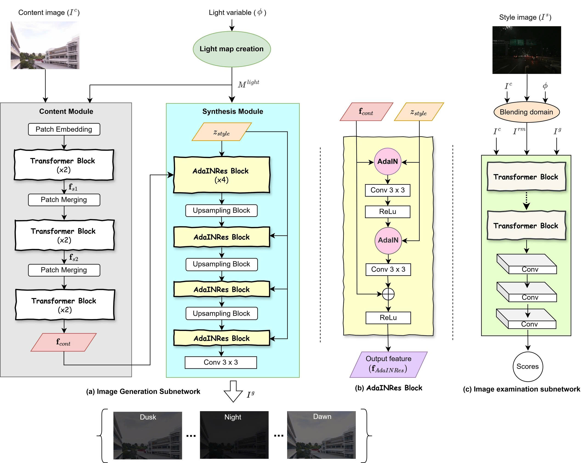

# CR-Net: Mạng kết xuất liên tục giúp tăng cường khả năng xử lý trong môi trường ánh sáng yếu

<p align="center">
    📄 <a href="link-to-your-paper"><b>Paper</b></a>&nbsp;&nbsp; | &nbsp;&nbsp;
    💻 <a href="https://github.com/val-utehy/CR-Net"><b>Mã nguồn</b></a>&nbsp;&nbsp; | &nbsp;&nbsp;
    🤗 <a href="https://huggingface.co/datasets/datnguyentien204/CR-Net"><b>Hugging Face</b></a>
</p>


<p align="center">
    
<p>

<p align="center">
    <em>Kiến trúc của mô hình CR-Net.</em>
<p>


## Giới thiệu

**CR-Net** là một model để cải thiện chất lượng hình ảnh và video trong điều kiện ánh sáng yếu. 
Bằng cách học một quy trình kết xuất liên tục, CR-Net có khả năng tăng cường độ sáng một cách hiệu quả, tạo ra kết quả tự nhiên và rõ nét ngay cả trong những môi trường thiếu sáng.
Để tìm hiểu thêm về CR-Net, vui lòng đọc tài liệu của chúng tôi [English](../README.md) | [Tiếng Việt](README-vi.md) | [中文](README-zh.md).


### Các tính năng chính

*   **Tăng cường chất lượng ảnh/video thiếu sáng:** Cải thiện đáng kể độ sáng và độ tương phản của hình ảnh và video được quay trong điều kiện ánh sáng yếu.
*   **Mạng kết xuất liên tục:** Áp dụng một kiến trúc mới lạ để mang lại kết quả mượt mà và tự nhiên hơn so với các phương pháp truyền thống.
*   **Ứng dụng linh hoạt:** Hỗ trợ xử lý cho cả video và thư mục chứa nhiều hình ảnh tĩnh.
## Demo


## Cài đặt và Yêu cầu

Để chạy mô hình này, bạn cần có môi trường phù hợp. Chúng tôi khuyến nghị sử dụng các phiên bản sau:

*   **Python:** `Python >= 3.10` (Khuyến nghị `Python 3.10`)
*   **PyTorch:** `PyTorch >= 1.12` (Khuyến nghị `PyTorch 2.1.2`)

**Bước 1: Clone repository**

```shell
  git clone https://github.com/val-utehy/CR-Net.git
  cd CR-Net
```

**Bước 2: Cài đặt các phụ thuộc**

```shell
  pip install -r requirements.txt
```

> [!NOTE]  
> Hãy chắc chắn rằng bạn đã cài đặt phiên bản **torch** và **torchvision** tương thích với **CUDA driver** để tận dụng GPU.


## Hướng dẫn sử dụng

### 1. Huấn luyện mô hình (Training)

Training file will be updated soon!

[//]: # (Để huấn luyện mô hình CR-Net trên bộ dữ liệu của riêng bạn, hãy làm theo các bước sau:)

[//]: # ()
[//]: # (**a. Cấu hình file script huấn luyện:**)

[//]: # ()
[//]: # (Mở và chỉnh sửa file `train_scripts/ast_n2h_dat.sh`. Trong file này, bạn cần chỉ định các đường dẫn quan trọng như đường dẫn đến bộ dữ liệu và nơi lưu checkpoint.)

[//]: # ()
[//]: # (**b. Chạy script huấn luyện:**)

[//]: # ()
[//]: # (Sau khi đã cấu hình xong, di chuyển đến thư mục gốc của dự án và thực thi lệnh sau:)

[//]: # ()
[//]: # (```shell)

[//]: # (    bash train_scripts/ast_n2h_dat.sh)

[//]: # (```)

### 2. Thử nghiệm và Inference (Testing and Inference)
**a. Xử lý video:**
#### 1. Cấu hình file scripts:
Mở và chỉnh sửa file test_scripts/ast_inference_video_dat.sh. Tại đây, bạn cần cung cấp đường dẫn đến checkpoint đã huấn luyện và video đầu vào/đầu ra.
#### 2. Chạy script xử lý video: 
Sau khi đã cấu hình xong, di chuyển đến thư mục gốc của dự án và thực thi lệnh sau:
```shell
  bash test_scripts/ast_inference_video.sh
```

**b. Xử lý thư mục ảnh:**
#### 1. Cấu hình file scripts:
Mở và chỉnh sửa file test_scripts/ast_n2h_dat.sh. Tại đây, bạn cần cung cấp đường dẫn đến checkpoint đã huấn luyện và thư mục ảnh đầu vào/đầu ra.

#### 2. Chạy script xử lý thư mục ảnh:
Sau khi đã cấu hình xong, di chuyển đến thư mục gốc của dự án và thực thi lệnh sau:
```shell
  bash test_scripts/ast_n2h.sh
```


## Trích dẫn (Citation)

[//]: # (```bibtex)

[//]: # (@article{crnet2025,)

[//]: # (    title={CR-Net: A Continuous Rendering Network for Improving Robustness to Low-illumination},)

[//]: # (    author={Tên tác giả 1 and Tên tác giả 2 and ...},)

[//]: # (    journal={Tên hội nghị hoặc tạp chí},)

[//]: # (    year={2025})

[//]: # (})

[//]: # (```)
## Tham khaor

1. https://github.com/EndlessSora/TSIT

2. https://github.com/astra-vision/CoMoGAN

3. https://github.com/AlienZhang1996/S2WAT

## Giấy phép (License)
CR-Net được cấp phép dưới giấy phép MIT. Vui lòng xem file [LICENSE](../LICENSE) để biết thêm chi tiết.

