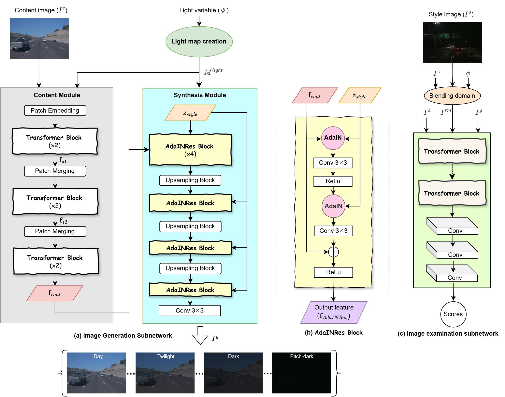

# CR-Net: 一种连续渲染网络，用于增强低光环境下的处理能力

<p align="center">
    📄 <a href="link-to-your-paper"><b>论文</b></a>&nbsp;&nbsp; | &nbsp;&nbsp;
    💻 <a href="https://github.com/val-utehy/CR-Net"><b>源码</b></a>&nbsp;&nbsp; | &nbsp;&nbsp;
    🤗 <a href="https://huggingface.co/datasets/datnguyentien204/CR-Net"><b>Hugging Face</b></a>
</p>

<p align="center">
    
<p>

<p align="center">
    <em>CR-Net 模型的架构。</em>
<p>


## 介绍

**CR-Net** 是一个深度学习模型，旨在提升在低光条件下的图像和视频质量。通过学习一个连续渲染过程，CR-Net 能够有效地恢复细节、减少噪声并增强亮度，从而在具有挑战性的弱光环境中生成自然清晰的结果。 要了解更多关于 CR-Net 的信息，请阅读我们的文档 [English](../README.md) | [Tiếng Việt](README-vi.md) | [中文](README-zh.md)。


### 主要特性

*   **增强低光图像/视频质量：** 显著改善在低光条件下拍摄的图像和视频的亮度与对比度。
*   **连续渲染网络：** 采用新颖的架构，比传统方法生成更加平滑、自然的效果。
*   **灵活应用：** 支持处理视频和包含多张静态图像的文件夹。

## 演示


## 安装与要求

要运行该模型，您需要合适的环境。我们推荐使用以下版本：

*   **Python:** `Python >= 3.10`（推荐使用 `Python 3.10`）
*   **PyTorch:** `PyTorch >= 1.12`（推荐使用 `PyTorch 2.1.2`）

**步骤 1: 克隆仓库**

```shell
  git clone https://github.com/val-utehy/CR-Net.git
  cd CR-Net

```

**步骤 2: 安装依赖**

```shell
  pip install -r requirements.txt
```

> [!注意]  
> 请确保您已安装与 **CUDA 驱动** 兼容的 **torch** 和 **torchvision** 版本，以充分利用 GPU。


## 使用指南

### 1. 模型训练 (Training)

要在您自己的数据集上训练 CR-Net，请按照以下步骤操作：

**a. 配置训练脚本文件：**

打开并编辑文件 `train_scripts/ast_n2h_dat.sh`。在该文件中，您需要指定重要路径，例如数据集路径和保存 checkpoint 的位置。

**b. 运行训练脚本：**

完成配置后，进入项目根目录并执行以下命令：

```shell
    bash train_scripts/ast_n2h_dat.sh

```

### 2. 测试与推理 (Testing and Inference)

**a. 视频处理：**

#### 1. 配置脚本文件：
打开并编辑文件 `test_scripts/ast_inference_video_dat.sh`。在此文件中，您需要提供训练好的 checkpoint 路径，以及输入/输出视频的路径。

#### 2. 运行视频处理脚本：
完成配置后，进入项目根目录并执行以下命令：

```shell
  bash test_scripts/ast_inference_video.sh
```

**b. 图像文件夹处理：**

#### 1. 配置脚本文件：
打开并编辑文件 `test_scripts/ast_n2h.sh`。在此文件中，您需要提供训练好的 checkpoint 路径，以及输入/输出图像文件夹的路径。

#### 2. 运行图像文件夹处理脚本：
完成配置后，进入项目根目录并执行以下命令：

```shell
  bash test_scripts/ast_n2h.sh
```


## 引用 (Citation)

[//]: # (```bibtex)

[//]: # (@article{crnet2025,)

[//]: # (    title={CR-Net: A Continuous Rendering Network for Improving Robustness to Low-illumination},)

[//]: # (    author={作者姓名1 and 作者姓名2 and ...},)

[//]: # (    journal={会议或期刊名称},)

[//]: # (    year={2025})

[//]: # (})

[//]: # (```)

## 许可证 (License)
CR-Net 在 MIT 许可证下发布。请参阅 [LICENSE](../LICENSE) 文件以获取更多详细信息。


